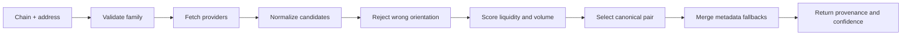

<div align="center">

# Multi-Chain Token Resolver

### Resolve the right token, pair, image, price, and capitalization without silently mixing MCAP and FDV.

   

</div>

`multi-chain-token-resolver` is a small TypeScript library and CLI for turning a chain plus token address into a transparent, typed market-data result. It was extracted as a general solution to recurring Web3 product problems: duplicate pools, incorrect token orientation, missing images, ambiguous EVM addresses, thin-liquidity pairs, and market cap being silently replaced by FDV.

Unlike a display-only token lookup, the resolver explains what it selected, where each value came from, and how confident the result is.

> This is an independent open-source reference implementation. It does not publish private PNLFlex or Baggy source code, provider credentials, internal routes, or production configuration.

## What it returns

```json
{
  "token": {
    "address": "0x21cf...b7ab",
    "chain": "base",
    "family": "evm",
    "name": "Example Token",
    "symbol": "EXAMPLE",
    "imageUrl": "https://..."
  },
  "priceUsd": 0.25,
  "capitalization": {
    "kind": "market-cap",
    "usd": 2100000,
    "source": "dex-screener"
  },
  "fdvUsd": 2500000,
  "marketCapUsd": 2100000,
  "confidence": {
    "level": "high",
    "score": 90,
    "reasons": ["canonical pair has at least $100K liquidity"]
  }
}
```

## Why this exists

A token address is not enough to produce trustworthy UI:

- the same token may have many pools with very different liquidity;
- an EVM address does not identify its network;
- a pair API may price only the base side, making quote-side reuse incorrect;
- `marketCap` may be unavailable while `FDV` exists;
- metadata can be present on a weaker pool or a different provider;
- provider success does not mean the returned pair is useful.

The resolver treats those as explicit data-model decisions rather than frontend formatting problems.

## Resolution pipeline



## Quick start

```bash
npm install
npm run build
```

Resolve an EVM token with an explicit chain:

```bash
npm run resolve -- --address 0x21cfcfc3d8f98fc728f48341d10ad8283f6eb7ab --chain base
```

Solana addresses infer the chain family:

```bash
npm run resolve -- --address So11111111111111111111111111111111111111112
```

Use it as a library:

```ts
import {
  DexScreenerProvider,
  GeckoTerminalProvider,
  TokenResolver
} from "@0xentyper/multi-chain-token-resolver";

const resolver = new TokenResolver({
  providers: [new DexScreenerProvider(), new GeckoTerminalProvider()],
  cacheTtlMs: 30_000
});

const token = await resolver.resolve({
  chain: "base",
  address: "0x21cfcfc3d8f98fc728f48341d10ad8283f6eb7ab"
});
```

## Correctness rules

| Rule | Reason |
| --- | --- |
| Require chain for EVM | The same hexadecimal address format exists on many networks |
| Infer Solana only from Base58 shape | Solana mints have a distinct address family |
| Accept only base-oriented pool prices | DexScreener's pair price describes the base token |
| Rank pools using liquidity and activity | The first returned pool is not automatically canonical |
| Preserve `marketCap` and `FDV` separately | FDV is not proof of circulating capitalization |
| Merge metadata after pair selection | A better image must not replace the market price source |
| Return source and confidence | Consumers should be able to explain a displayed number |
| Cache final results briefly | Reduce rate pressure without hiding stale data for long periods |

## Pair scoring

Candidate ranking combines:

- logarithmic USD liquidity weight;
- logarithmic 24-hour volume weight;
- availability of a valid USD price;
- explicit market cap before FDV-only data;
- preferred stable or native quote assets;
- metadata completeness as a small tie-breaker.

The score is deterministic and exported through `TokenResolver.score()` for inspection. It is a selection heuristic, not a token-safety rating.

## Capitalization semantics

The output never calls FDV market cap:

- `kind: "market-cap"` means a provider returned a distinct market-cap field;
- `kind: "fdv"` means verified market cap was unavailable and FDV is the best explicit valuation;
- `kind: "unavailable"` means neither value was usable.

This follows the providers' documented behavior. DexScreener exposes both fields separately, while GeckoTerminal may return `market_cap_usd: null` when supply is not verified.

## Supported networks

Ethereum, Base, BNB Chain, Arbitrum, Optimism, Polygon, Avalanche, and Solana are mapped for both included providers. The type model makes new networks an explicit code change instead of accepting arbitrary unverified identifiers.

## Provider model

Providers implement one interface:

```ts
interface TokenDataProvider {
  readonly name: string;
  resolve(
    request: Required<ResolveRequest>,
    context: ProviderContext
  ): Promise<ProviderCandidate[]>;
}
```

The resolver uses `Promise.allSettled`, so one provider may fail without discarding valid candidates from another. If every provider fails or returns only unsafe pair orientations, the error includes provider-level context.

## Verification

The test suite covers:

- EVM and Solana address classification;
- explicit EVM network requirements;
- deterministic canonical-pair ranking;
- quote-side price rejection;
- FDV and market-cap separation;
- metadata fallback without pair replacement;
- in-memory TTL caching.

Run all release checks:

```bash
npm run check
npm test
npm run build
```

## Data-source notes

- [DexScreener API reference](https://docs.dexscreener.com/api/reference)
- [DexScreener capitalization methodology](https://docs.dexscreener.com/token-listing)
- [GeckoTerminal API introduction](https://apiguide.geckoterminal.com/)
- [GeckoTerminal API FAQ](https://apiguide.geckoterminal.com/faq)

Provider data can be delayed, incomplete, or incorrect. This package improves selection and transparency; it does not certify a token, pool, contract, or valuation.

## Repository scope

This repository contains a clean reference implementation, tests, CLI, and provider adapters. It intentionally excludes private production code, keys, paid API access, proprietary provider ranking, and product-specific storage.

## Author

Built by [0xENTYPER](https://github.com/0xENTYPER).
