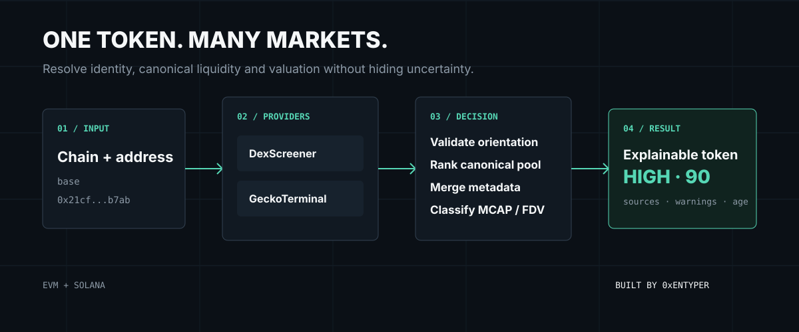
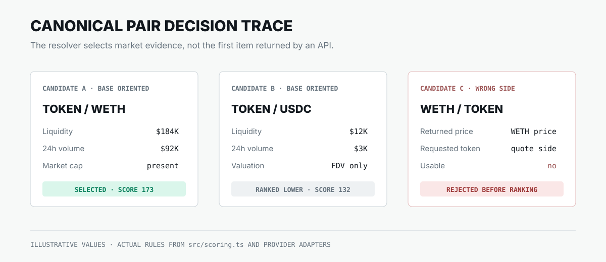
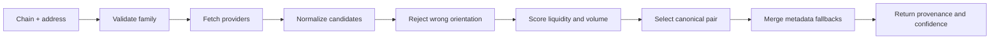
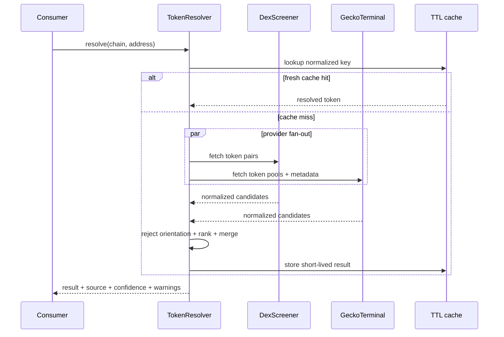
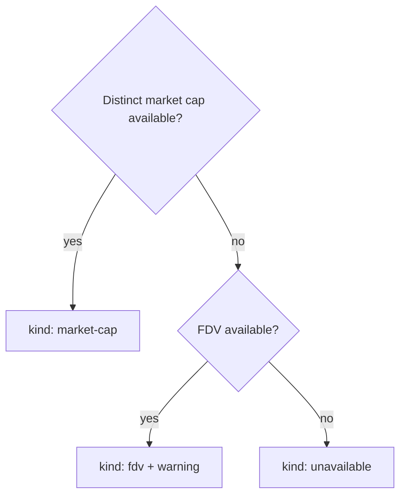
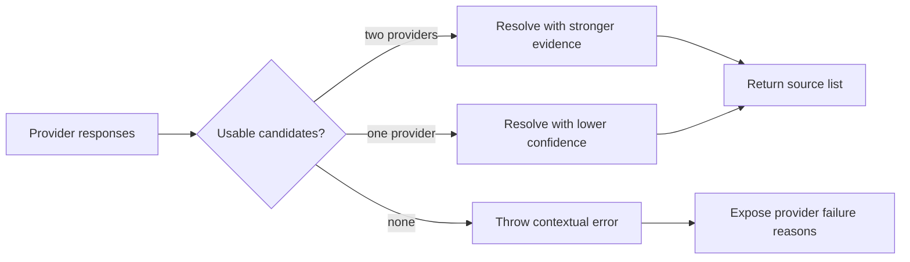

<div align="center">

# Multi-Chain Token Resolver

### Resolve the right token, pair, image, price, and capitalization without silently mixing MCAP and FDV.

    [](https://github.com/0xENTYPER/multi-chain-token-resolver/actions/workflows/ci.yml)

</div>



`multi-chain-token-resolver` is a small TypeScript library and CLI for turning a chain plus token address into a transparent, typed market-data result. It was extracted as a general solution to recurring Web3 product problems: duplicate pools, incorrect token orientation, missing images, ambiguous EVM addresses, thin-liquidity pairs, and market cap being silently replaced by FDV.

Unlike a display-only token lookup, the resolver explains what it selected, where each value came from, and how confident the result is.

> This is an independent open-source reference implementation. It does not publish private PNLFlex or Baggy source code, provider credentials, internal routes, or production configuration.

## At a glance

| Input | Providers | Decision | Output |
| --- | --- | --- | --- |
| Chain + token address | DexScreener + GeckoTerminal | Validate, normalize, rank, merge | Identity, image, price, pair, MCAP/FDV, provenance, confidence |
| EVM or Solana | Independent failure paths | Deterministic scoring | Typed JSON or CLI output |

**The product decision:** uncertainty is returned as data. Missing MCAP, weak liquidity, a failed provider, or an ambiguous EVM network must never disappear behind a polished number.

### Read this repository by role

- **Product:** start with [Why this exists](#why-this-exists) and [Capitalization semantics](#capitalization-semantics).
- **Engineering:** inspect [Resolution pipeline](#resolution-pipeline), [Pair scoring](#pair-scoring), and the test suite.
- **Data:** review [Field lineage](#field-lineage) and [Failure behavior](#failure-behavior).
- **UI:** use [Confidence as product state](#confidence-as-product-state) for display rules.

## What it returns

```json
{
  "token": {
    "address": "0x21cf...b7ab",
    "chain": "base",
    "family": "evm",
    "name": "Example Token",
    "symbol": "EXAMPLE",
    "imageUrl": "https://..."
  },
  "priceUsd": 0.25,
  "capitalization": {
    "kind": "market-cap",
    "usd": 2100000,
    "source": "dex-screener"
  },
  "fdvUsd": 2500000,
  "marketCapUsd": 2100000,
  "confidence": {
    "level": "high",
    "score": 90,
    "reasons": ["canonical pair has at least $100K liquidity"]
  }
}
```

## Why this exists

A token address is not enough to produce trustworthy UI:

- the same token may have many pools with very different liquidity;
- an EVM address does not identify its network;
- a pair API may price only the base side, making quote-side reuse incorrect;
- `marketCap` may be unavailable while `FDV` exists;
- metadata can be present on a weaker pool or a different provider;
- provider success does not mean the returned pair is useful.

The resolver treats those as explicit data-model decisions rather than frontend formatting problems.



The values above are illustrative; the orientation and ranking behavior is implemented in the provider adapters and [`src/scoring.ts`](src/scoring.ts).

## Resolution pipeline



The providers run concurrently rather than serially. Normalization happens at each adapter boundary, so the central resolver never needs to understand provider-specific JSON shapes.



## Quick start

```bash
npm install
npm run build
```

Resolve an EVM token with an explicit chain:

```bash
npm run resolve -- --address 0x21cfcfc3d8f98fc728f48341d10ad8283f6eb7ab --chain base
```

Solana addresses infer the chain family:

```bash
npm run resolve -- --address So11111111111111111111111111111111111111112
```

Use it as a library:

```ts
import {
  DexScreenerProvider,
  GeckoTerminalProvider,
  TokenResolver
} from "@0xentyper/multi-chain-token-resolver";

const resolver = new TokenResolver({
  providers: [new DexScreenerProvider(), new GeckoTerminalProvider()],
  cacheTtlMs: 30_000
});

const token = await resolver.resolve({
  chain: "base",
  address: "0x21cfcfc3d8f98fc728f48341d10ad8283f6eb7ab"
});
```

<details>
<summary><strong>Example decision-ready output</strong></summary>

```json
{
  "token": {
    "chain": "base",
    "family": "evm",
    "symbol": "EXAMPLE",
    "imageUrl": "https://provider-cdn.example/token.png"
  },
  "priceUsd": 0.25,
  "capitalization": {
    "kind": "market-cap",
    "usd": 2100000,
    "source": "dex-screener"
  },
  "pair": {
    "dex": "uniswap",
    "quoteSymbol": "WETH",
    "liquidityUsd": 184000,
    "volume24hUsd": 92000
  },
  "confidence": {
    "level": "high",
    "score": 90,
    "reasons": [
      "canonical pair has at least $100K liquidity",
      "provider returned a distinct market-cap field",
      "multiple providers returned usable candidates"
    ]
  },
  "sources": [
    { "provider": "dex-screener", "candidateCount": 3 },
    { "provider": "gecko-terminal", "candidateCount": 2 }
  ],
  "warnings": []
}
```

Example values are illustrative; the schema is the real exported contract.

</details>

## Correctness rules

| Rule | Reason |
| --- | --- |
| Require chain for EVM | The same hexadecimal address format exists on many networks |
| Infer Solana only from Base58 shape | Solana mints have a distinct address family |
| Accept only base-oriented pool prices | DexScreener's pair price describes the base token |
| Rank pools using liquidity and activity | The first returned pool is not automatically canonical |
| Preserve `marketCap` and `FDV` separately | FDV is not proof of circulating capitalization |
| Merge metadata after pair selection | A better image must not replace the market price source |
| Return source and confidence | Consumers should be able to explain a displayed number |
| Cache final results briefly | Reduce rate pressure without hiding stale data for long periods |

## Pair scoring

Candidate ranking combines:

- logarithmic USD liquidity weight;
- logarithmic 24-hour volume weight;
- availability of a valid USD price;
- explicit market cap before FDV-only data;
- preferred stable or native quote assets;
- metadata completeness as a small tie-breaker.

The score is deterministic and exported through `TokenResolver.score()` for inspection. It is a selection heuristic, not a token-safety rating.

### Why logarithmic weights

Raw liquidity would allow a single very large pool to dominate every other signal. Logarithmic weighting keeps liquidity decisive while preserving room for price availability, volume, quote quality, and explicit capitalization evidence.

```text
candidate score
  = log10(liquidity) weight
  + log10(24h volume) weight
  + valid price bonus
  + market-cap evidence bonus
  + preferred quote bonus
  + small metadata tie-breaker
```

The exact implementation is intentionally readable in [`src/scoring.ts`](src/scoring.ts), and its behavior is locked by [`test/scoring.test.ts`](test/scoring.test.ts).

## Capitalization semantics

The output never calls FDV market cap:

- `kind: "market-cap"` means a provider returned a distinct market-cap field;
- `kind: "fdv"` means verified market cap was unavailable and FDV is the best explicit valuation;
- `kind: "unavailable"` means neither value was usable.

This follows the providers' documented behavior. DexScreener exposes both fields separately, while GeckoTerminal may return `market_cap_usd: null` when supply is not verified.



## Field lineage

The selected pair controls price and market context. Metadata may safely fall back to another ranked candidate, but doing so never changes the canonical pair.

| Output field | Selection rule | Why |
| --- | --- | --- |
| `priceUsd` | Canonical pair only | Prevent cross-pool price mixing |
| `pair.*` | Canonical pair only | Keep liquidity, volume, DEX and age coherent |
| `name`, `symbol`, `imageUrl` | First usable value across ranked candidates | Recover presentation metadata without replacing price evidence |
| `marketCapUsd` | First explicit MCAP value | Never synthesize circulating supply silently |
| `fdvUsd` | First explicit FDV value | Preserve a separate valuation concept |
| `sources` | Every provider with usable candidates | Make coverage and freshness inspectable |
| `warnings` | Derived from missing/weak evidence | Give product UI a truthful degraded state |

## Supported networks

Ethereum, Base, BNB Chain, Arbitrum, Optimism, Polygon, Avalanche, and Solana are mapped for both included providers. The type model makes new networks an explicit code change instead of accepting arbitrary unverified identifiers.

| Family | Networks | Address handling |
| --- | --- | --- |
| EVM | Ethereum, Base, BNB Chain, Arbitrum, Optimism, Polygon, Avalanche | Chain is required; address is normalized case-insensitively |
| Solana | Solana | Base58 mint shape identifies the family; exact mint orientation is required |

## Provider model

Providers implement one interface:

```ts
interface TokenDataProvider {
  readonly name: string;
  resolve(
    request: Required<ResolveRequest>,
    context: ProviderContext
  ): Promise<ProviderCandidate[]>;
}
```

The resolver uses `Promise.allSettled`, so one provider may fail without discarding valid candidates from another. If every provider fails or returns only unsafe pair orientations, the error includes provider-level context.

## Failure behavior



The resolver degrades narrowly:

- one failed provider does not blank a valid token;
- one successful HTTP request does not guarantee a usable candidate;
- wrong-side pairs are rejected rather than inverted without evidence;
- low liquidity becomes a warning and confidence penalty;
- no usable evidence returns an error instead of placeholder market data.

## Confidence as product state

Confidence is evidence quality, not a safety or investment score.

| Level | Suggested UI treatment | Typical evidence |
| --- | --- | --- |
| High | Normal presentation with source details available | Deep canonical liquidity, valid price, explicit MCAP, multiple providers |
| Medium | Show a subtle data-quality note | Usable price with limited depth or provider agreement |
| Low | Keep warnings visible and avoid strong valuation language | Thin liquidity, FDV-only valuation, or weak provider coverage |

This distinction matters because a technically valid response can still be inappropriate for a large headline number.

## Engineering boundaries

```text
address.ts                  input validation and family detection
chains.ts                   explicit provider network mapping
providers/*                 external JSON -> normalized candidates
scoring.ts                  deterministic canonical-pair ranking
resolver.ts                 orchestration, merge, confidence, warnings
cache.ts                    short-lived resolved-result cache
cli.ts                      inspectable command-line entry point
test/*                      behavioral contract
```

The structure keeps provider churn at the edge. Adding another provider should not change the public output contract or the resolver's product semantics.

## Verification

The test suite covers:

- EVM and Solana address classification;
- explicit EVM network requirements;
- deterministic canonical-pair ranking;
- quote-side price rejection;
- FDV and market-cap separation;
- metadata fallback without pair replacement;
- in-memory TTL caching.

Run all release checks:

```bash
npm run check
npm test
npm run build
```

### Invariants protected by tests

```text
wrong pair orientation  -> never reused as token price
missing MCAP            -> never relabeled FDV
metadata fallback       -> never replaces canonical pair
provider failure        -> never discards another valid source
same normalized request -> cache hit inside TTL
expired cache           -> provider refresh
```

## What this case study demonstrates

- translating inconsistent third-party APIs into a stable product contract;
- distinguishing data availability from data correctness;
- encoding UX language such as MCAP, FDV, confidence, and warnings in types;
- designing provider fallbacks without silently mixing incompatible evidence;
- supporting EVM and Solana without pretending their address models are identical;
- exposing enough provenance to debug a wrong number in production.

## Data-source notes

- [DexScreener API reference](https://docs.dexscreener.com/api/reference)
- [DexScreener capitalization methodology](https://docs.dexscreener.com/token-listing)
- [GeckoTerminal API introduction](https://apiguide.geckoterminal.com/)
- [GeckoTerminal API FAQ](https://apiguide.geckoterminal.com/faq)

Provider data can be delayed, incomplete, or incorrect. This package improves selection and transparency; it does not certify a token, pool, contract, or valuation.

## Repository scope

This repository contains a clean reference implementation, tests, CLI, and provider adapters. It intentionally excludes private production code, keys, paid API access, proprietary provider ranking, and product-specific storage.

## Related work

- [onchain-market-data-pipeline](https://github.com/0xENTYPER/onchain-market-data-pipeline) applies the same evidence-first approach at the Cloudflare edge.
- [wallet-pnl-lab](https://github.com/0xENTYPER/wallet-pnl-lab) carries explicit provenance into realized-PnL accounting.
- [PNLFlex](https://github.com/0xENTYPER/pnlflex) shows how resolved token data becomes a user-facing research and creator workflow.

## Author

Built by [0xENTYPER](https://github.com/0xENTYPER).
